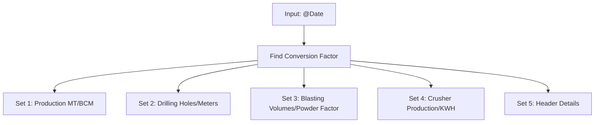
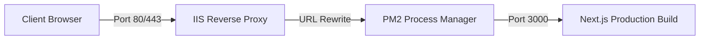

# ProMS (Production Management System) - Comprehensive Knowledge Base

Welcome to the **ProMS (Production Management System)** Knowledge Base. This document provides a complete, exhaustive breakdown of the ProMS software architecture, database schema, domain logic, data models, deployment settings, and custom configurations. It has been prepared to serve as a comprehensive blueprint for developers to understand, maintain, modify, or migrate the system into a separate project.

---

## 1. System Overview & Business Domain

ProMS is an enterprise-grade, high-performance web application tailored for managing production and logistics operations in the **mining sector**. 

### 1.1 Core Business Objects
*   **Equipment Operations**: Tracking haulers, loading machines, drill rigs, water tankers, crushers, and electrical plants.
*   **Shifts & Personnel**: Coordinating multiple shifts, shift leaders, operators, and relays.
*   **Materials Handling**: Recording the excavation and transport of materials like ROM Coal, Top Soil, Over Burden (OB), and Inter Burden (IB).
*   **Logistics**: Managing source-to-destination mappings, haulage trip counts, capacities, and density conversion factors.
*   **Drilling & Blasting**: Logging spacing, burden, depth, hole counts, explosive weights (SME), deck charging, and structural volumes.
*   **Crusher Processing**: Monitoring belt scale weights, running hours, electricity utilization (KWH), and equipment stoppages.

### 1.2 System Workflows
1.  **Dynamic Masters Setup**: Admin users establish companies, locations, equipment models, materials, active operator roles, and target settings.
2.  **Daily Log Entries**: Operations teams record shift logs via customized data forms with dynamic autofill, Excel templates, and duplicate warnings.
3.  **Audit Logs & History**: All records are tagged with automated metadata capturing creating and updating personnel (`CreatedBy`, `UpdatedBy`) and exact datetimes.
4.  **Operational Dashboard**: Key business intelligence metrics (coal outputs, waste handling, equipment breakdowns) displayed inside graphical charting structures.
5.  **DPR Reporting**: Automatic compilation of complex multi-table operational metrics into standard "Daily Progress Reports" (DPR) utilizing stored procedures.

---

## 2. Technical Stack & Infrastructure

ProMS is built with a lightweight, optimized, and secure modern stack:

*   **Frontend Framework**: Next.js (React.js using the modern App Router).
*   **Backend Server**: Next.js API Routes running inside Node.js.
*   **Styling & UI Aesthetics**: 
    *   **Vanilla CSS Module System** (`*.module.css`) for maximum design flexibility and custom animations.
    *   Sleek custom themer (`ThemeProvider.js`) supporting **Light/Dark Mode** saved in LocalStorage/Cookies.
    *   Premium dashboard components with glassmorphism layout, clean HSL palettes, and fluid UI micro-animations.
*   **Core Libraries**:
    *   **Data Forms**: Native validation engine and dynamic keyboard grid navigation (pressing Enter or Tab shifts focus to the next field).
    *   **Charts**: Custom dashboard metrics powered by charting libraries.
    *   **Data Grid**: Customized grid (`DataTable.js` / `MasterTable.js` / `TransactionTable.js`) featuring column sorting, paging controls (10, 20, 50, all), global search, and file exports.
    *   **Excel Services**: Integration with `xlsx-js-style` to generate highly styled worksheets and handle bulk spreadsheets upload.
*   **Database Engine**: Microsoft SQL Server (MS SQL) deployed on `MURALI\SQLEXPRESS` (configured for both SQL Auth and Windows Auth) using database `ProdMS_live` (fallback to `ProMS2_Serv`).
*   **Database Driver**: `mssql` node driver with dynamic, pool-cached client connections.

---

## 3. Database Schema & Architecture

ProMS splits its relational models across two primary SQL schemas:
1.  **`[Master]`**: Stores static configuration records, mappings, users, pages, and reference data.
2.  **`[Trans]`**: Stores daily logs, entries, activity details, and operational records.

### 3.1 Dynamic DB Selection Mechanism
The application dynamically selects databases at runtime by looking up user cookie settings or environment fallbacks (`lib/db.js`):
```javascript
const DEFAULT_DB = process.env.DB_DATABASE || 'ProMS2_Serv';
// Retrieves client selected database from cookies ('current_db')
selectedDb = cookieStore.get('current_db')?.value || DEFAULT_DB;
```
Connection pools are cached globally inside the Node.js memory layer (`pools[safeDbName]`) to maximize performance.

### 3.2 Master Configuration Schema (`[Master]`)

Below are the structured database tables and models registered inside the central config controller (`lib/masterConfig.js`):

| Schema Table | Description | Key Fields & Configuration |
| :--- | :--- | :--- |
| `[Master].[Vendor]` | Companies offering transport/operations | `SlNo` (ID), `VendorName` |
| `[Master].[TblConversionFactor]` | Density factors for coal weights | `SlNo`, `FromDate` (Date), `ToDate` (Date), `Factor` (Decimal 18,2), `Remarks`, `IsActive` |
| `[Master].[TblCompany]` | Company identity and visuals | `SlNo`, `CompanyName` (Unique), `GstNo`, `Address`, `CompanyLogo` (base64 image) |
| `[Master].[TblActivity]` | Operational states / scopes | `SlNo`, `Name` (Unique), `IsDetail` (Bit), `IsActive` |
| `[Master].[TblDepthSlab]` | Drilling depth categories | `SlNo`, `Name` (Unique), `IsActive` |
| `[Master].[TblDestination]` | Logistics drop points | `SlNo`, `Name` (Unique), `IsActive` |
| `[Master].[TblDestinationMaterialMapping]` | Allowed materials per destination | `SlNo`, `DestinationId`, `MaterialId` |
| `[Master].[TblEntryType]` | Categorization of data inputs | `SlNo`, `Name` (Unique), `IsActive` |
| `[Master].[TblEquipmentGroup]` | Equipment models and makes | `SlNo`, `Name` (Unique), `IsQtyTripMapping` (Bit - defines custom load factors), `IsActive` |
| `[Master].[TblEquipmentOwnerType]` | Equipment ownership classes | `SlNo`, `Type` (Unique), `IsActive` |
| `[Master].[TblEquipment]` | Haulers, shovels, and drill models | `SlNo`, `PMSCode` (Unique - Auto generated as `2000000 + SlNo`), `EquipmentGroupId` (FK), `EquipmentName` (Long), `EuipmentID` (Short), `CostCenter`, `OwnerTypeId` (FK), `VendorCode` (FK), `ActivityId` (FK), `ScaleId` (FK), `Capacity` (Decimal), `UnitId` (FK), `TripQty`, `FuelTypeId` (FK), `IsActive` |
| `[Master].[TblLocation]` | Geographical operational areas | `SlNo`, `LocationName` (Unique), `Remarks`, `IsActive` (Supports bulk upload) |
| `[Master].[TblLocationType]` | Categorization of locations | `SlNo`, `LocationType` (Unique), `Remarks`, `IsActive` |
| `[Master].[TblMaterial]` | Mined resources properties | `SlNo`, `MaterialName` (Unique), `UnitId` (FK), `DrillingOutput` (Decimal), `Order` (Int), `Remarks`, `IsActive` |
| `[Master].[TblMethod]` | Extraction methodologies | `SlNo`, `Name` (Unique), `IsActive` |
| `[Master].[TblOperatorCategory]` | Labor roles class | `SlNo`, `Name` (Unique) |
| `[Master].[TblOperatorSubCategory]` | Specialized labor subsets | `SlNo`, `Name` (Unique) |
| `[Master].[TblOperator]` | Registered drivers and staff | `SlNo`, `OperatorId` (Unique), `OperatorName`, `MobileNo`, `CategoryId` (FK), `SubCategoryId` (FK), `Remarks`, `IsActive` (Supports bulk upload) |
| `[Master].[TblPatch]` | Active working pits | `SlNo`, `Name` (Unique), `IsActive` |
| `[Master].[TblPlant]` | Fixed crushing/power facilities | `SlNo`, `Name` (Unique), `IsDetails` (Bit), `IsHaulerFieldShow` (Bit), `IsDPRReport` (Bit), `IsActive` |
| `[Master].[TblQtyTripMapping]` | Tailored load-factors per group+material | `SlNo`, `EquipmentGroupId` (FK), `MaterialId` (FK), `ManagementQtyTrip` (Decimal), `NTPCQtyTrip` (Decimal), `IsActive` (Composite unique index) |
| `[Master].[TblRelay]` | Shift group rotations | `SlNo`, `Name` (Unique), `IsActive` |
| `[Master].[TblScale]` | Weight scales definitions | `SlNo`, `Name` (Unique), `IsActive` |
| `[Master].[TblSector]` | Operational zones | `SlNo`, `SectorName` (Unique), `Remarks`, `IsActive` |
| `[Master].[TblShift]` | Operating hours ranges | `SlNo`, `ShiftName` (Unique), `FromTime`, `ToTime` |
| `[Master].[TblShiftIncharge]` | Assigned shift supervisors | `SlNo`, `ShiftId` (FK), `ShiftDate` (Date), `RelayId` (FK) |
| `[Master].[TblSMESupplier]` | Chemical/Explosive vendors | `SlNo`, `Name` (Unique), `SMECategoryId` (FK), `IsActive` |
| `[Master].[TblSource]` | Excavation starting locations | `SlNo`, `Name` (Unique), `IsActive` |
| `[Master].[TblStoppageCategory]` | Delay groups (Mechanical, Electrical, Idle) | `SlNo`, `Name` (Unique), `Remarks`, `IsActive` |
| `[Master].[TblStoppageReason]` | Individual downtime causes | `SlNo`, `ReasonName` (Unique), `CategoryId` (FK), `Remarks`, `IsActive` (Supports bulk upload) |
| `[Master].[TblStrata]` | Geological layer classifications | `SlNo`, `Name` (Unique), `IsActive` |
| `[Master].[TblUnit]` | Target measure metrics (MT, BCM, meters) | `SlNo`, `Name` (Unique), `IsActive` |
| `[Master].[TblSMECategory]` | Explosive categories | `SlNo`, `Category` (Unique), `Remarks` |
| `[Master].[TblDrillingRemarks]` | Common drilling notes | `SlNo`, `DrillingRemarks` (Unique), `Remarks` |
| `[Master].[TblBDReason]` | Breakdown categories | `SlNo`, `BDReasonName` (Unique), `IsActive` |
| `[Master].[tblParty]` | Client representatives | `SlNo`, `PartyName` (Unique), `Remarks`, `IsActive` |
| `[Master].[TblRole_New]` | Security roles allocation | `SlNo`, `RoleName` (Unique), `Remarks`, `IsActive` |
| `[Master].[TblUser_New]` | System operators credentials | `SlNo`, `EmpName`, `UserName` (Unique), `Password` (Encrypted), `RoleId` (FK), `ContactNo`, `EmailID`, `Remarks`, `IsActive` |
| `[Master].[TblDrillingAgency]` | Drilling service agencies | `SlNo`, `AgencyName` (Unique), `Remarks`, `IsActive` |
| `[Master].[tblFillingPoint]` | Fuel dispatch points | `SlNo`, `FillingPoint` (Unique), `Remarks`, `IsActive` |
| `[Master].[tblFillingPump]` | Fuel delivery pumps | `SlNo`, `FillingPump` (Unique), `Remarks`, `IsActive` |
| `[Master].[TblFuelType]` | Energy sources details | `SlNo`, `FuelType` (Unique), `Remarks`, `IsActive` |
| `[Master].[TblModule]` | Left navigation sidebar segments | `SlNo`, `ModuleName` (Unique), `Icon`, `SortOrder` |
| `[Master].[TblPage]` | Individual page routing nodes | `SlNo`, `PageName`, `PagePath` (Unique), `IsActive` |
| `[Master].[TblRoleAuthorization_New]` | Role-to-Page permissions map | `SlNo`, `RoleId` (FK), `PageId` (FK), `IsView` (Bit), `IsActive` |

### 3.3 Transaction Logging Schema (`[Trans]` / `[Transaction]`)

Daily logs are tracked with granular logging tables mapped inside `lib/transactionConfig.js`:

#### 1. Drilling (`[Trans].[TblDrilling]`)
*   **Key Fields**: `DateOfDrilling`, `DateOfBlasting`, `DrillingPatchId` (Links to Blasting), `DrillingAgencyId` (FK), `EquipmentId` (FK), `MaterialId` (FK), `LocationId` (FK), `SectorId` (FK), `ScaleId` (FK), `StrataId` (FK), `DepthSlabId` (FK), `NoofHoles` (Int), `TotalMeters` (Decimal), `Spacing` (Decimal), `Burden` (Decimal), `TopRLBottomRL`, `AverageDepth` (Decimal), `Output` (Decimal), `UnitId` (FK), `TotalQty` (Decimal), `DrillingRemarksId` (FK), `Remarks`
*   **Calculations**:
    $$\text{Volume} = \text{TotalMeters} \times \text{Spacing} \times \text{Burden} \times \text{Strata Output Factor}$$
    $$\text{Total Quantity} = \text{Volume} \times \text{Material Density Factor}$$

#### 2. Loading From Mines (`[Trans].[TblLoading]`)
*   **Key Fields**: `LoadingDate`, `ShiftId` (FK), `ShiftInchargeId` (FK), `MidScaleInchargeId` (FK), `ManPowerInShift` (Int), `RelayId` (FK), `SourceId` (FK), `DestinationId` (FK), `MaterialId` (FK), `HaulerEquipmentId` (FK), `LoadingMachineEquipmentId` (FK), `NoofTrip` (Int), `QtyTrip` (Mgmt Load Factor), `NtpcQtyTrip` (NTPC Load Factor), `TotalQty` (Calculated), `TotalNtpcQty` (Calculated), `UnitId` (FK)
*   **Calculations**:
    $$\text{TotalQty (Mgmt)} = \text{NoofTrip} \times \text{QtyTrip}$$
    $$\text{TotalNtpcQty (NTPC)} = \text{NoofTrip} \times \text{NtpcQtyTrip}$$

#### 3. Material Rehandling (`[Trans].[TblMaterialRehandling]`)
*   **Key Fields**: Identical layout to standard loading, designed to track re-transporting stockpile materials within internal deposits.

#### 4. Internal Transfer (`[Trans].[TblInternalTransfer]`)
*   **Key Fields**: Core transfer details to log movements of material inside custom mining plants and hoppers.

#### 5. Equipment Reading (`[Trans].[TblEquipmentReading]`)
*   **Key Fields**: `Date`, `ShiftId` (FK), `ShiftInchargeId` (FK), `MidScaleInchargeId` (FK), `RelayId` (FK), `ActivityId` (FK), `EquipmentId` (FK), `OperatorId` (FK), `OHMR` (Open Hour Meter Reading), `CHMR` (Close Hour Reading), `NetHMR` (Net Hours), `OKMR` (Open Kilometer Reading), `CKMR` (Close Kilometer), `NetKMR` (Net Kilometers), `DevelopmentHrMining`, `FaceMarchingHr`, `DevelopmentHrNonMining`, `BlastingMarchingHr`, `RunningBDMaintenanceHr`, `TotalWorkingHr`, `BDHr` (Breakdown Hours), `MaintenanceHr`, `IdleHr`, `SectorId` (FK), `PatchId` (FK), `MethodId` (FK), `Remarks`
*   **Time Balance Validation**:
    $$\text{NetHMR} = \text{CHMR} - \text{OHMR}$$
    $$\text{NetHMR} = \text{TotalWorkingHr} + \text{BDHr} + \text{MaintenanceHr} + \text{IdleHr}$$

#### 6. Blasting Operations (`[Trans].[TblBlasting]`)
*   **Key Fields**: `Date`, `BlastingPatchId` (Unique composite key matching Drilling patch), `SMESupplierId` (FK), `SMEQty` (Kg), `MaxChargeHole` (Kg), `PPV` (mm/sec), `NoofHolesDeckCharged` (Int), `NoofWetHole` (Int), `AirPressure`, `TotalExplosiveUsed` (Kg), `Remarks`
*   **Sub-Table Relationship**: Has a nested 1-to-many relationship with Accessories details: `SED`, `TotalBoosterUsed`, `TotalNonelMeters`, `TotalTLDMeters`.

#### 7. Crusher Production (`[Trans].[TblCrusher]`)
*   **Key Fields**: `Date`, `ShiftId` (FK), `ShiftInChargeId` (FK), `ManPowerInShift` (Int), `PlantId` (FK), `BeltScaleOHMR`, `BeltScaleCHMR`, `ProductionUnitId` (FK), `ProductionQty` (Calculated), `HaulerId` (FK), `NoofTrip`, `QtyTrip`, `TripQtyUnitId` (FK), `TotalQty` (Calculated), `OHMR`, `CHMR`, `RunningHr`, `PowerKWH`, `TotalStoppageHours`, `Remarks`
*   **Sub-Table Relationship**: Custom stoppages detail logging: `FromTime`, `ToTime`, `StoppageReasonId` (FK), `StoppageHours`, `Remarks`.

#### 8. Water Tanker Log (`[Transaction].[TblWaterTankerEntry]`)
*   **Key Fields**: `EntryDate`, `ShiftId` (FK), `DestinationId` (FK), `HaulerId` (FK), `FillingPointId` (FK), `FillingPumpId` (FK), `NoOfTrip` (Int), `Capacity` (Decimal), `TotalQty` (Calculated), `Remarks`

---

## 4. Authentication & Legacy Cryptography

ProMS uses an explicit, legacy cryptographic algorithm to maintain absolute compatibility with active databases and historic users data.

### 4.1 Legacy Password Cryptography (Triple DES / DES-EDE3-ECB)
The application utilizes a static cryptographic key string to perform MD5-based key expansions and runs symmetric **Triple DES (3DES) in Electronic Codebook (ECB)** configuration (`lib/auth.js`):

*   **Symmetric Encryption Key String**:
    `rytTHh42t5Aagite95R95erktlwe454asR1254fase5454un5g45Ka8vg54d45Sa5astg`
*   **Node.js Implementation Details**:
    ```javascript
    import crypto from 'crypto';

    const LEGACY_KEY_STRING = "rytTHh42t5Aagite95R95erktlwe454asR1254fase5454un5g45Ka8vg54d45Sa5astg";

    export function encryptPassword(password) {
        const md5Hash = crypto.createHash('md5').update(LEGACY_KEY_STRING, 'utf8').digest();
        const key = Buffer.concat([md5Hash, md5Hash.slice(0, 8)]); // Expands MD5 hash to 24-byte key for 3DES
        const cipher = crypto.createCipheriv('des-ede3-ecb', key, null);
        cipher.setAutoPadding(true);
        let encrypted = cipher.update(password, 'utf8', 'base64');
        encrypted += cipher.final('base64');
        return encrypted;
    }

    export function decryptPassword(encryptedPassword) {
        if (!encryptedPassword) return '';
        const md5Hash = crypto.createHash('md5').update(LEGACY_KEY_STRING, 'utf8').digest();
        const key = Buffer.concat([md5Hash, md5Hash.slice(0, 8)]);
        const decipher = crypto.createDecipheriv('des-ede3-ecb', key, null);
        decipher.setAutoPadding(true);
        let decrypted = decipher.update(encryptedPassword, 'base64', 'utf8');
        decrypted += decipher.final('utf8');
        return decrypted;
    }
    ```

### 4.2 Security Architecture (JWT + RBAC Middleware)
1.  **JWT Signing**: On login verification (`verifyUser`), a JSON Web Token is signed using a environment-backed `JWT_SECRET` containing the user's metadata:
    `{ id: SlNo, username: UserName, name: EmpName, role: RoleName, roleId: RoleId }`
2.  **Cookie Persistence**: The token is saved in the browser context via an HTTP-Only secure cookie named `auth_token`.
3.  **Authentication Middleware**: Next.js middleware guards the `/dashboard/:path*` route scope. If the `auth_token` is missing or validation fails, it redirects the browser to the root portal (`/`).
4.  **Granular Page Authorization (RBAC)**: Custom routing checks look up page paths inside `[Master].[TblPage]` and cross-reference access profiles inside `[Master].[TblRoleAuthorization_New]` to verify view privileges:
    ```sql
    SELECT PermissionId 
    FROM [Master].[TblRoleAuthorization_New]
    WHERE RoleId = @roleId AND PageId = @pageId AND IsView = 1 AND IsActive = 1 AND IsDelete = 0
    ```

---

## 5. The Dynamic Framework Model

One of ProMS's key architectural patterns is the **metadata-driven dynamic configuration layout** for CRUD screens.

```mermaid
graph TD
    A[Client Request: /dashboard/master/company] --> B[MasterPage dynamic route]
    B --> C[Fetch MASTER_CONFIG['company']]
    C --> D[Render generic MasterTable]
    D --> E[API Request to /api/master/company]
    E --> F[Dynamic JSON CRUD Route /api/master/[slug]]
    F --> G[SQL Query using config.table]
```

### 5.1 Dynamic Master Pages
By creating a generic Dynamic Segment folder at `app/dashboard/master/[type]/page.js`, ProMS serves all master directories automatically using a single page skeleton and a declarative config (`lib/masterConfig.js`):
```javascript
export default function MasterPage({ params }) {
    const { type } = use(params);
    const config = MASTER_CONFIG[type];
    if (!config) return notFound();
    return <MasterTable config={config} title={title} />;
}
```

### 5.2 Dynamic CRUD Endpoints (`/api/master/[slug]/route.js`)
Rather than maintaining dozens of redundant CRUD files, a centralized dynamic route handles basic database operations (GET, POST, PUT, DELETE) dynamically by resolving table parameters defined under the `MASTER_CONFIG` metadata. 

#### API Design Highlights:
*   **Security check**: Validates the incoming `slug` parameter against trusted keys in `MASTER_CONFIG` to prevent path traversal/SQL injection.
*   **GET**: Formulates query scopes dynamically, includes custom left-joins (e.g. mapping `VendorCode` inside equipment definitions), and decrypts saved credentials for the user master.
*   **POST**: Builds inserting columns automatically based on properties:
    ```javascript
    config.columns.forEach(colObj => {
        const col = colObj.accessor;
        if (body[col] !== undefined) {
            fields.push(col);
            values.push(`@${col}`);
            request.input(col, body[col]); // Auto parameterized bindings
        }
    });
    ```
*   **PUT**: Assembles column update parameters, handles checkbox bit castings, and triggers specialized hooks like MD5 encryption for updated passwords.
*   **DELETE**: Standardizes soft-deletes across all components:
    ```sql
    UPDATE ${config.table} 
    SET IsDelete = 1, UpdatedDate = GETDATE(), UpdatedBy = 1 
    WHERE ${config.idField} = @Id
    ```

---

## 6. Daily Progress Report (DPR) Reporting Stored Procedure

The heartbeat of ProMS reporting is the core SQL Stored Procedure `[dbo].[PMS2_New_Sp_DailyProgressReport]`. It aggregates daily progress data into 5 distinct result sets inside a single execution path.



### 6.1 Logical Walkthrough & Math Formulas

#### 1. Variable Preparations & Date Anchors
Calculates chronological parameters based on input `@Date`:
*   `@StartOfMonth`: First day of current month.
*   `@StartOfNextMonth`: First day of next calendar month.
*   `@StartOfYear`: First day of current calendar year.

#### 2. Conversion Factor Lookup
Looks up the active density conversion factor (defaults to `1.55` if no active configurations exist):
```sql
SELECT TOP 1 @ConversionFactor = Factor 
FROM [Master].[TblConversionFactor] WITH(NOLOCK)
WHERE @Date BETWEEN FromDate AND ToDate AND IsActive = 1 AND IsDelete = 0
```

#### 3. Production Compilation (Result Set 1)
Aggregates quantities from `[Trans].[TblLoading]` into a temporary storage schema `#TempProduction`.
*   Fetches cumulative statistics across three periods: **Day**, **Month to Date (MTD)**, and **Year to Date (YTD)**.
*   Groups categories into **ROM Coal** (MT), **Top Soil** (BCM), **Over Burden** (BCM), and **Inter Burden** (BCM).
*   **Total Waste**: Sum of BCM materials (Top Soil + OB + IB).
*   **Total Excavation**: Combines coal tonnage converted to volume plus bulk waste volume:
    $$\text{Total Excavation (BCM)} = \left( \frac{\text{Coal Tonnage (MT)}}{\text{Conversion Factor}} \right) + \text{Total Waste (BCM)}$$

#### 4. Drilling Metrics (Result Set 2)
Combines drilling metrics from `[Trans].[TblDrilling]` and machine execution details from `[Trans].[TblEquipmentReading]`:
*   Calculates drilled holes and cumulative meters drilled (FTD, MTD, YTD).
*   Matches rig working times (activity category 7) from equipment logs to compute operating efficiency.

#### 5. Blasting & Volumetric Metrics (Result Set 3)
Tracks chemical operations and computes volume yields:
*   Combines active drilling logs with explosive inputs (`[Trans].[TblBlasting]`).
*   **Blasting Volume (BCM)**:
    $$\text{Volume} = \text{Meters} \times \text{Spacing} \times \text{Burden} \times \text{Strata Factor}$$
    *(Strata Factor: `0.95` for ROM Coal, `0.90` for other materials)*
*   **Powder Factor (BCM/Kg)**:
    $$\text{Powder Factor} = \frac{\text{Total Blasting Volume (BCM)}}{\text{Total Explosives Used (Kg)}}$$

#### 6. Crusher Throughput (Result Set 4)
Processes performance yields from `[Trans].[TblCrusher]`:
*   Aggregates running hours, scale volumes, and electricity consumption (KWH).
*   **Electrical Efficiency (KWH/Hr)**:
    $$\text{Electrical Rate} = \frac{\text{Power Consumed (KWH)}}{\text{Running Hours (Hrs)}}$$

---

## 7. Utility Systems (Dates, Excel Export/Upload)

ProMS integrates dynamic utilities to ensure data consistency, clean report rendering, and simple batch uploads.

### 7.1 Robust Date Formatting & Parsing (`lib/date-utils.js`)
Operations staff enter date metrics in various styles. The backend utilizes `formatReportDate` to standardize all inputs into `dd - MMM - yyyy` (e.g. `09 - Apr - 2026`):
```javascript
export const formatReportDate = (dateStr) => {
    if (!dateStr) return '';
    const cleanStr = String(dateStr).trim();
    // 1. Parses dd/mm/yyyy or dd/mm/yy formats
    if (cleanStr.includes('/')) { ... }
    // 2. Parses yyyy-mm-dd ISO strings
    if (cleanStr.includes('-') && cleanStr.split('-')[0].length === 4) { ... }
    // 3. Standardizes dd-MMM-yy strings
    ...
}
```

### 7.2 Scalable Data Exports Pattern
When users trigger file exports, the system fetches all matching records by setting maximum fetch thresholds and builds a styled spreadsheet using Excel integrations:
```javascript
const handleExportAll = async () => {
    const params = new URLSearchParams({ offset: '0', limit: '1000000', ...filters });
    const res = await fetch(`${config.apiEndpoint}?${params}`);
    const result = await res.json();
    
    // Process columns, apply custom table styles, and trigger download
    const ws = XLSX.utils.json_to_sheet(result.data);
    const wb = XLSX.utils.book_new();
    XLSX.utils.book_append_sheet(wb, ws, 'Report');
    XLSX.writeFile(wb, 'Export.xlsx');
};
```

---

## 8. IIS Reverse Proxy & PM2 Production Deployment

ProMS is configured for deployment on Windows Server environments using Internet Information Services (IIS) as a public-facing proxy and PM2 as the process engine.



### 8.1 PM2 Process Settings (`ecosystem.config.js`)
Configures the Node.js production daemon:
```javascript
module.exports = {
  apps: [{
    name: 'ProMS',
    script: 'node_modules/next/dist/bin/next',
    args: 'start',
    instances: 'max',
    exec_mode: 'cluster',
    env: {
      PORT: 3000,
      NODE_ENV: 'production'
    }
  }]
}
```

### 8.2 IIS Web Rules (`web.config`)
Integrates incoming IIS requests to PM2 port bindings using the **IIS URL Rewrite Module**:
```xml
<?xml version="1.0" encoding="UTF-8"?>
<configuration>
    <system.webServer>
        <rewrite>
            <rules>
                <rule name="ReverseProxyInboundRule1" stopProcessing="true">
                    <match url="(.*)" />
                    <action type="Rewrite" url="http://localhost:3000/{R:1}" />
                </rule>
            </rules>
        </rewrite>
    </system.webServer>
</configuration>
```

### 8.3 Deployment Checklist
1.  **Next.js Production Compilation**:
    ```powershell
    npm run build
    ```
2.  **Package Static Assets**:
    Execute `prepare_deploy.bat` to transfer static assets to the standalone directory:
    ```powershell
    robocopy public .next\standalone\public /E
    robocopy .next\static .next\standalone\.next\static /E
    ```
3.  **Transfer to Server**: Copy the `.next/standalone` files alongside `ecosystem.config.js`, `web.config`, and `.env.production` to `C:\inetpub\wwwroot\ProMS`.
4.  **Launch Web Service**:
    ```powershell
    pm2 start ecosystem.config.js
    pm2 save
    ```

---

## 9. Project Separation & Migration Blueprint

If you plan to extract these schemas, configs, or modules to set up a brand new application, follow this structured separation blueprint:

```
[Target New Project Root]
 ├── app/                      <-- Copy pages & routing files
 │    ├── api/                 <-- Retain auth, dynamic master API & transactions
 │    └── dashboard/           <-- Copy view modules & dashboard pages
 ├── components/               <-- Copy shared DataTable, Form, and Layout components
 ├── contexts/                 <-- Keep Theme & Session contexts intact
 ├── database/                 <-- Hold SQL table definitions & seed scripts
 ├── lib/                      <-- The engine: db.js, auth.js, config schemas
 ├── public/                   <-- Copy logos, static images, and spreadsheet templates
 ├── styles/                   <-- Copy global themes and typography
 ├── .env.local                <-- Establish localized connection strings
 ├── package.json              <-- Ensure mssql, jwt, and xlsx dependencies match
 └── web.config                <-- Keep for Windows IIS target deployment
```

### 9.1 Phase 1: Environment & Dependency Alignment
Create your target directory and initialize a fresh Next.js application:
```powershell
npx create-next-app@latest ./ --javascript --css --src-dir=false --experimental-app
```
Install the core enterprise dependencies inside `package.json`:
```powershell
npm install mssql jsonwebtoken xlsx-js-style lucide-react react-hook-form
```

### 9.2 Phase 2: Copying Core Engine Modules
Migrate the fundamental configurations and database drivers first:
1.  Copy the entire `lib/` directory. This includes:
    *   `lib/db.js`: Handles database client creation.
    *   `lib/auth.js`: Powers MD5 3DES cryptography and session processing.
    *   `lib/masterConfig.js` & `lib/transactionConfig.js`: Dynamic framework schemas.
    *   `lib/date-utils.js`: Standardizes dates.
2.  Setup `.env.local` inside the root folder with key variables:
    ```env
    DB_USER=your_db_username
    DB_PASSWORD=your_db_password
    DB_SERVER=your_database_host
    DB_DATABASE=ProdMS_live
    DB_PORT=1433
    JWT_SECRET=your_custom_jwt_secret_token
    ```

### 9.3 Phase 3: SQL Tables Migration
1.  Verify the targeted SQL Server has the standard schemas (`Master` and `Trans`) registered:
    ```sql
    CREATE SCHEMA [Master];
    CREATE SCHEMA [Trans];
    ```
2.  Run your master table creation scripts, ensuring table names align exactly with definitions in `lib/masterConfig.js`.
3.  Deploy the core reporting stored procedure (`PMS2_New_Sp_DailyProgressReport`) to generate dashboards and compiled reports.

### 9.4 Phase 4: Frontend Layout & UI Setup
1.  Copy the `components/` directory containing all generic widgets:
    *   `DataTable.js` (Paging, searching, ordering layout)
    *   `MasterTable.js` (Generic master list and form wrapper)
    *   `TransactionTable.js` & `TransactionForm.js`
    *   `DashboardLayout.js`, `Header.js`, `Sidebar.js`
2.  Copy global CSS rules and variables from `app/globals.css` and local stylesheets.
3.  Copy dynamic routing folders:
    *   `/app/api/master/[slug]/route.js` (Central Master CRUD endpoint)
    *   `/app/dashboard/master/[type]/page.js` (Dynamic Master view loader)
    *   Individual transaction APIs `/app/api/transaction/*` and view folders `/app/dashboard/transaction/*`.

---

This Knowledge Base has been compiled to contain every necessary business rule, technical configuration, and deployment instruction. By following this document, any developer can easily reconstruct, debug, or separate the ProMS platform into a new system.
